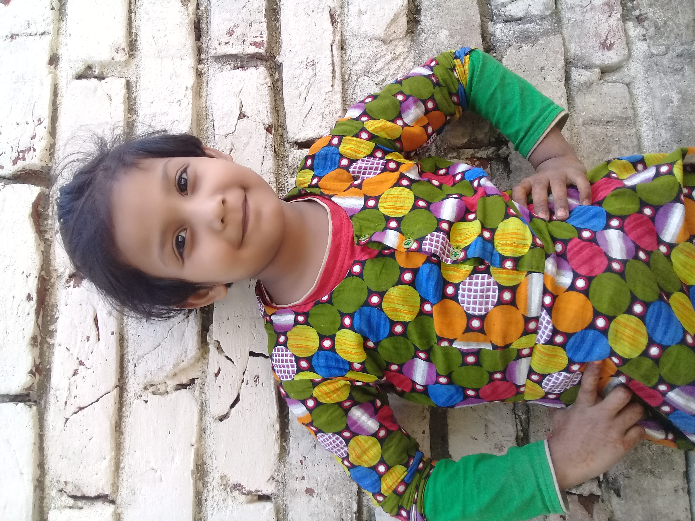

<!--markdown turorial-->

Afsar Uddin<br/>
This is second line

---

# Afsar Uddin

## Afsar Uddin

### Afsar Uddin

#### Afsar Uddin

##### Afsar Uddin

###### Afsar Uddin

<p>This is afsar uddin. I am 20 years old. I just finished my HSC exam from South Point School & College</p>

<br/>

### Italic text
<i>This is an italic text</i>  
_This is an italic text_

<br/>

### Bold text
__This is an bold text__

<br/>

### Strikethorugh
<del>This is afsar uddin </del>  
~~This is afsar uddin~~

<br/>

### single line code
`This is inline`  
`<h1>Bangladesh</h1>`

<br/>

### Multiple line code
```html
 <html>

 <head></head>
 <body></body>
 </html>

```
```css
 head{
    background-color: green;
 }

```
```javascript
 console.log('hello')

```

<br/>

### Ordered list
1. item1  
2. item2 
    1. item1.1
    2. item1.2
3. item3

<br/>

### Unordered list
- item1
    - item1.1
    - item1.2
- item2
- item3

<br/>

### Task list
- [x] Task1
- [x] Task2
- [] Task3

<br/>

### Automatic Link
http://www.studywithanis.com

### disable link
`http://www.studywithanis.com`

### markdown link syntax
[studywithanis](http://www.studywithanis.com)

### markdown link syntax
[studywithanis][websitelink]  
[facebook][facebooklink]


<!--all link is here-->
[websitelink]:http://www.studywithanis.com
[facebooklink]:http://www.studywithanis.com

<br/>

### Image syntax
<!---->


🙂

<br/>

### Table
| Name | old |   
| --- | --- |  
| afsar | 20|  
| asif | 21 |
| afran | 22 |


